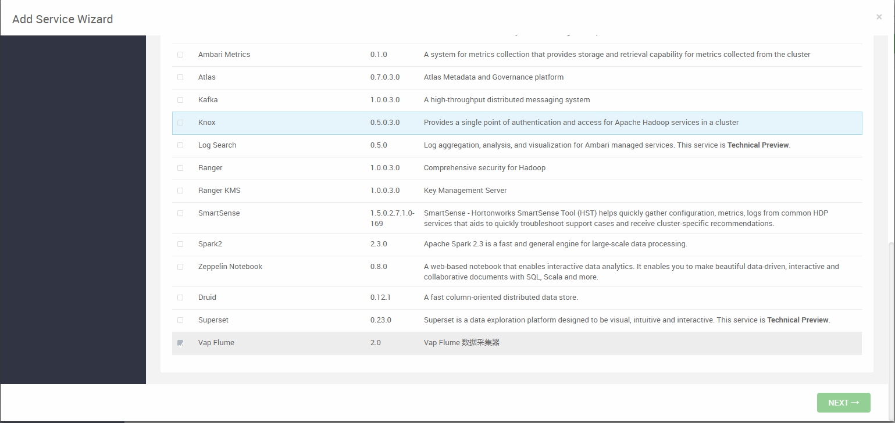
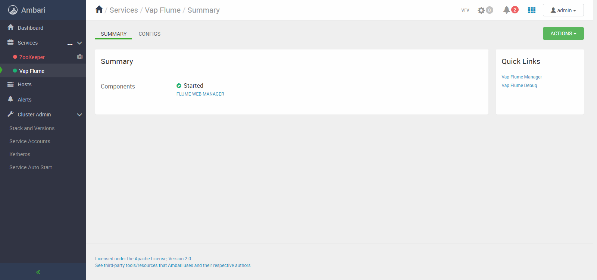
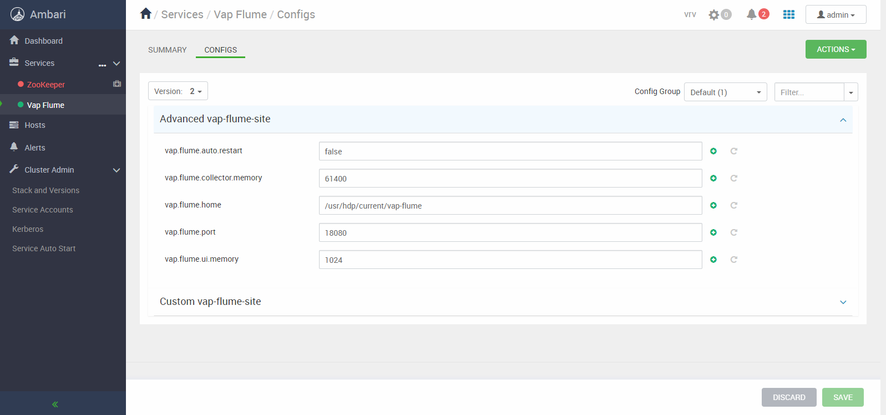

 # ambari 2.7 服务集成
---------

## 组件集成

- 制作自己组件的RPM包 vap_flume-2.0-1.el7.centos.x86_64.rpm
- 安装 createrepo
```
yum install createrepo
```
- 将制作的RPM包放在 /var/www/html/HDP/centos7/3.0.1.0-187/vap_flume 下
- 删除 /var/www/html/HDP/centos7/3.0.1.0-187/repodata
- 重新生成 repodata
```
cd /var/www/html/HDP/centos7/3.0.1.0-187
createrepo ./
```
- 更新 yum 源
```
yum clean all
yum repolist
```
- 验证是否添加成功
> [root@public-repo-1 3.0.1.0-187]# yum search vap_flume<br>
> Loaded plugins: fastestmirror<br>
> Loading mirror speeds from cached hostfile<br>
>  * base: mirrors.cn99.com<br>
>  * extras: mirrors.163.com<br>
>  * updates: mirrors.njupt.edu.cn<br>
> ====================================== N/S matched: vap_flume ======================================<br>
> vap_flume.x86_64 : vrv audit platform flume<br>
> 
>   Name and summary matches only, use "search all" for everything.<br>

## ambari service 集成
创建一个service文件夹，目录结构如下

```
VAPFLUME  #service名称,必须大写
├─configuration  #配置文件目录
├─package  #相关脚本目录
│  └─scripts  #启停脚本目录
└─quicklinks  #链接目录
```

- VAPFLUME 下创建 metainfo.xml

```
<?xml version="1.0"?>
<metainfo>
    <schemaVersion>2.0</schemaVersion>
    <services>
        <service>
            <name>VAPFLUME</name>
            <displayName>Vap Flume</displayName>
            <comment>Vap Flume 数据采集器</comment>
            <version>2.0</version>
            
            <quickLinksConfigurations>
                <quickLinksConfiguration>
                  <fileName>quicklinks.json</fileName>
                  <default>true</default>
                </quickLinksConfiguration>
            </quickLinksConfigurations>
            
            <components>
                <component>
                    <name>VAP_FLUME_UI</name>
                    <displayName>Flume Web Manager</displayName>
                    <category>MASTER</category>
                    <cardinality>1</cardinality>
                    <commandScript>
                        <script>scripts/vap_flume.py</script>
                        <scriptType>PYTHON</scriptType>
                        <timeout>600</timeout>
                    </commandScript>
                </component>
            </components>
            
            <osSpecifics>
                <osSpecific>
                    <osFamily>any</osFamily>
                    <packages>
                        <package>
                          <name>vap-flume</name>
                        </package>
                  </packages>
                </osSpecific>
            </osSpecifics>
            
            <configuration-dependencies>
                <config-type>vap-flume-site</config-type>
            </configuration-dependencies>
        </service>
    </services>
</metainfo>
```

- VAPFLUME/configuration 下创建 vap-flume.xml

```
<?xml version="1.0"?>
<?xml-stylesheet type="text/xsl" href="configuration.xsl"?>
 
<configuration>
 <property>
    <name>vap.flume.port</name>
    <value>28080</value>
    <description>flume 管理平台页面访问端口.</description>
 </property>
 <property>
    <name>vap.flume.home</name>
    <value>/usr/hdp/current/vap-flume</value>
    <description>flume 管理平台家目录.</description>
 </property>
  <property>
    <name>vap.flume.ui.memory</name>
    <value>1024</value>
    <description>flume 管理平台内存配置.</description>
 </property>
 <property>
    <name>vap.flume.collector.memory</name>
    <value>61400</value>
    <description>flume 管理平台采集器最大可用内存.</description>
 </property>
 <property>
    <name>vap.flume.auto.restart</name>
    <value>false</value>
    <description>监控采集器配置文件并自动重启.</description>
 </property>
</configuration>
```

- VAPFLUME/package/scripts 下创建 params.

```
#!/usr/bin/env python

import sys, os 
from resource_management.libraries.script.script import Script

config = Script.get_config()

port = config['configurations']['vap-flume-site']['vap.flume.port']
home = config['configurations']['vap-flume-site']['vap.flume.home']
ui_memory = config['configurations']['vap-flume-site']['vap.flume.ui.memory']
collector_memory = config['configurations']['vap-flume-site']['vap.flume.collector.memory']
auto_restart = config['configurations']['vap-flume-site']['vap.flume.auto.restart']

app_shell_origin = sys.path[0]+"/../files/start-ambari-flume.sh"
app_shell = home + "/start-ambari-flume.sh"
app_run = app_shell
```

- VAPFLUME/package/scripts 下创建 vap-flume.py

```
#!/usr/bin/env python

import sys, os 
import json 
import logging 
import platform 
from resource_management import * 
from resource_management.core.logger import Logger

class VapFlumeServer(Script):
  def install(self, env):
    import params
    env.set_params(params)

    self.configure(env)
    self.install_packages(env)

  def status(self, env):
    pidfile = "/var/run/vap-flume/vap-flume.pid"
    Logger.info("Check "+pidfile)
    check_process_status(pidfile)

  def configure(self, env):
    Logger.info("Cofigure Vap Flume ...")
    import params
    env.set_params(params)

  def start(self, env):
    import params
    env.set_params(params)

    self.configure(env)

    print params.app_shell_origin
    if not os.path.exists(params.app_shell) :
      cp_cmd = format("cp {app_shell_origin} {home};chmod 755 {app_shell}")
      Execute(cp_cmd)
      
    start_cmd = format("{app_run} start -p {port} -h {home} -jm {ui_memory} -mam {collector_memory} -ar {auto_restart}")
    Execute(start_cmd)

  def stop(self, env):
    import params
    env.set_params(params)

    self.configure(env)

    stop_cmd = format("{app_run} stop")
    Execute(stop_cmd)
 
if __name__ == "__main__":
  VapFlumeServer().execute()
```

- VAPFLUME/package/files 下创建 start-ambari-flume.sh

```
#!/bin/bash
export FLUME_UI_HOME=/usr/hdp/current/vap-flume
export FLUME_UI_APP=vap-flume-ui.jar
export IS_AMBARI=true
export FLUME_CONFIG_HOME=/etc/vap-flume
FLUME_PID_PATH=/var/run/vap-flume
FLUME_PID_FILE=vap-flume.pid

f_pid() {
  if [ ! -d "$FLUME_PID_PATH" ];then
    mkdir -p $FLUME_PID_PATH
    echo 0
  fi
  pidfile=`ls $FLUME_PID_PATH`
  if [[ "" != "$pidfile" ]] ;then
    fpid=`cat $FLUME_PID_PATH/$FLUME_PID_FILE`
    echo $fpid
  else
    echo 0
  fi
}

f_fix() {
  val_input=$1
  val_default=$2
  if [ -z "$val_input" ] ;then
    echo $val_default
  else
    echo $val_input
  fi
}

f_help() {
  cat <<EOF
示例: $0 <命令> [可选参数]...

命令:
  help                      show this help
  start                     start flume ui
  stop                      stop flume ui
  status                    show status
  
start 参数:
  --port,-p                 flume ui port,default 28080
  --max-allow-memory,-mam   default 61440MB
  --jvm-memory,-jm          jvm memory,default 1024mb
  --auto-restart,-ar        watch config file and auto reload
  
stop 参数:
  --force                   kill -9 pid
  
EOF
}

f_check() {
  appath=$FLUME_UI_HOME/$FLUME_UI_APP
  if [ -f "$appath" ] ;then
    if [ -r "$appath" -a -w "$appath" -a -x "$appath" ] ;then
      echo "check $appath        ------------------OK"
	else
	  chmod 755 "$appath"
	  echo "fix $appath        ------------------OK"
	fi
  else
  	echo "check $appath        ------------------FAIL"
  	return 0
  fi
  appath2=$FLUME_UI_HOME/flume/bin/flume-ng
  if [ -f "$appath2" ] ;then
    if [ -r "$appath2" -a -w "$appath2" -a -x "$appath2" ] ;then
      echo "check $appath2        ------------------OK"
	else
	  chmod 755 "$appath2"
	  echo "fix $appath2        ------------------OK"
	fi
  else
  	echo "check $appath2        ------------------FAIL"
  	return 0
  fi
  return 1
}

f_start() {
  pid=`f_pid`
  if [[ 0 = "$pid" ]] || [[ "-1" = "$pid" ]];then
    f_check
    stat=$?
    if [[ 1 = "$stat" ]] ;then
      if [ ! -d "$FLUME_UI_HOME/logs" ];then
        mkdir -p $FLUME_UI_HOME/logs
      fi
      args="-Xms$1m -Xmx$1m -DFLUME_UI_HOME=$FLUME_UI_HOME -DFLUME_UI_PORT=$2 -DMAX_ALLOW_MEM=$3 -DAUTO_RESTART=$4 -DIS_AMBARI=true -DFLUME_CONFIG_HOME=/etc/vap-flume"
	    java $args -jar $FLUME_UI_HOME/$FLUME_UI_APP > /dev/null &
      fpid=$!
      if [ ! -d "$FLUME_PID_PATH" ];then
        mkdir -p $FLUME_PID_PATH
      fi
      echo $fpid > $FLUME_PID_PATH/$FLUME_PID_FILE
      sleep 2
      echo $fpid 
    fi
  else
    echo "$pid"
  fi
}

f_stop() {
  pid=`f_pid`
  if [[ 0 = "$pid" ]] || [[ "-1" = "$pid" ]];then
    echo "not running"
  else
    kill -$1 $pid
    rm -f $FLUME_PID_PATH/$FLUME_PID_FILE
  fi
}

f_status() {
  pid=`f_pid`
  if [ 0 = "$pid" ] ;then 
    echo "not running" 
  else 
    echo $pid
  fi
}

cmd=$1

case "$cmd" in
  start)
    while [ -n "$*" ] ;do
    arg=$1
    shift
      case $arg in
        --port|-p)
          ui_port=$1
          shift
        ;;
        --max-allow-memory|-mam)
          mam=$1
          shift
        ;;
        --jvm-memory,-jm)
          jvmm=$1
          shift
        ;;
        --auto-restart,-ar)
          auto=$1
          shift
        ;;
      esac
    done
    export FLUME_UI_AUTH=false
    export FLUME_UI_AUTH_URL="http://localhost:8080/token/confirmation"
    FLUME_JVM=`f_fix $jvmm 1024`
    FLUME_UI_PORT=`f_fix $ui_port 28080`
    MAX_ALLOW_MEM=`f_fix $mam 61400`
    AUTO_RESTART=`f_fix $auto false`
    f_start $FLUME_JVM $FLUME_UI_PORT $MAX_ALLOW_MEM $AUTO_RESTART
  ;;
  stop)
    if [ "$2" = "--force" ] ;then
	    sign=9
    else
      sign=15
    fi
    f_stop $sign
  ;;
  status)
    f_status
  ;;
  *)
    f_help
  ;;
esac
```

- 将 VAPFLUME 文件夹放入 /var/lib/ambari-server/resources/stacks/HDP/3.0/services 重启 ambari 即可在 add service 中看到新增的服务
  - 安装
    
  - 启动
    
  - 配置
    