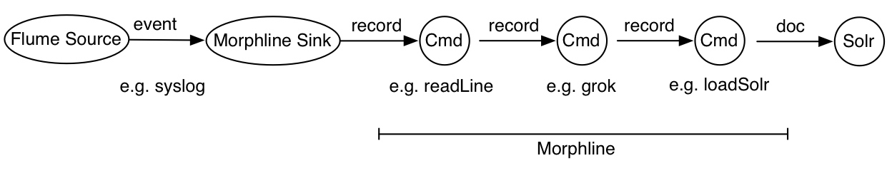

# MorphlineInterceptor使用介绍

--------

- 数据处理流程
  

- 一个测试用的flume配置
接收udp协议数据,经过拦截器处理后输出到控制台

```conf
#agent配置信息
a1.channels = c1 
a1.sources = r1 
a1.sinks = k1 

#channel配置信息
#内存通道
a1.channels.c1.type = memory
a1.channels.c1.capacity = 1000000
a1.channels.c1.transactionCapacity = 10000

#source配置信息
#UDP服务端接收组件
a1.sources.r1.type = UdpServerSource
a1.sources.r1.batch = 0
a1.sources.r1.charsetIn = UTF-8
a1.sources.r1.charsetOut = UTF-8
a1.sources.r1.port = 514
a1.sources.r1.flushInterval = 600
a1.sources.r1.assetsFilter = false
a1.sources.r1.interceptors = i1 
a1.sources.r1.interceptors.i1.type = org.apache.flume.sink.solr.morphline.MorphlineInterceptor$Builder
a1.sources.r1.interceptors.i1.morphlineFile = D:/flume_ui/file/00/morphline.conf
a1.sources.r1.interceptors.i1.morphlineId = morphline1

#sink配置信息
#JSON输出到控制台组件
a1.sinks.k1.type = JsonStringSink
#sink与channel配置信息
a1.sinks.k1.channel = c1

#source与channel配置信息
a1.sources.r1.channels = c1
```

> 测试数据
>
> <2>viruslog: 2018-10-17 12:38:34#0x0502060000548000#LP0761792493#Macro.Agent.c#其他#低#未知传毒单位名#10.166.224.247#55734#公司名称#10.169.180.119#5002#ftp#GET 材料列表.doc#32768

- morphline.conf配置内容

```conf
morphlines : [
  {
    id : morphline1  #对应a1.sources.r1.interceptors.i1.morphlineId
    importCommands : ["org.kitesdk.**"]
    commands : [
        {
            java {
                imports: "import java.util.*;"
                code: """
                    //获取原始字符串
                    Object a1 = record.getFirstValue("_attachment_body");
                    byte[] a2 = (byte[])a1;
                    //logger.info(new String(a2));
                    //将原始字符串放入event的header中
                    record.put("message",new String(a2,"GBK"));
                    return child.process(record);
                    """
            }
        }
        {
            grok {
                dictionaryFiles: ["D:/vscode/java/kite-master/kite-morphlines/kite-morphlines-core/src/test/resources/grok-dictionaries"]
                expressions : {
                    #正规处理message字段
                    message : """<%{POSINT:priority}>%{TEST_LABEL:label}: %{TEST_DATE:date}#%{GREEDYDATA:msg}"""
                }
            }
        }
        {
            #分割正则提取的msg字段
            split {
                inputField: msg
                separator: "#"
                outputFields: [areaCode,code,name,remark,level,unit,ip,number,company,ip2,number2,type,command,number3]
            }
        }
        {
            #@{field} => 取出头信息中的字段值,拼接字符串,替换原始字符串
            setValues {
                _attachment_body: """{"priority":@{priority},"label":@{label},"date":@{date},"message":@{msg},"areaCode":@{areaCode},"name":@{name}}"""
            }
        }
        {
            #将原始字符串转为byte[]类型,供后续sink处理
            toByteArray {
                field: _attachment_body
                charset: GBK
            }
        }
    ]
  }
]
```

- 命令介绍

命令|说明
--|--
addCurrentTime|将System.currentTimeMillis()的返回值添加到指定字段
addLocalHost|将本地ip或主机名添加到指定字段
addValues|将配置的value添加到指定字段
addValuesIfAbsent|如果指定字段的值不存在，则将value添加到指定字段
callParentPipe|Implements recursion for extracting data from container data formats.
contains|判断指定字段是否包含配置的value
convertTimestamp|将指定字段按配置的时间格式进行转换
decodeBase64|将base64字符串解码为byte[]
dropRecord|删除数据. 类似输出到 /dev/null.
equals|判断指定字段value是否和配置的相等
extractURIComponents|解析URI,分解出host, port, path, query等信息
extractURIComponent|Extracts a particular subcomponent from a URI.
extractURIQueryParameters|Extracts the query parameters with a given name from a URI.
findReplace|Examines each string value in a given field and replaces each substring of the string value that matches the given string literal or grok pattern with the given replacement.
generateUUID|生成UUID到指定字段
grok|使用正则表达式提取字段信息
head|只获取前n条数据
if|if-then-else逻辑处理
java|动态的编译和执行指定的java代码
logTrace, logDebug, logInfo, logWarn, logError|Logs a message at the given log level to SLF4J.
not|Inverts the boolean return value of a nested command.
pipe|Pipes a record through a chain of commands.
removeFields|根据黑白名单过滤字段
removeValues|根据黑白名单过滤value
replaceValues|根据黑白名单替换value
sample|随机过滤数据
separateAttachments|Emits one separate output record for each attachment in the input record's list of attachments.
setValues|Assigns a given list of values (or the contents of another field) to a given field.
split|Divides a string into substrings, by recognizing a separator (a.k.a. "delimiter") which can be expressed as a single character, literal string, regular expression, or grok pattern.
splitKeyValue|Splits key-value pairs where the key and value are separated by the given separator, and adds the pair's value to the record field named after the pair's key.
startReportingMetricsToCSV|Starts periodically appending the metrics of all commands to a set of CSV files.
startReportingMetricsToJMX|Starts publishing the metrics of all commands to JMX.
startReportingMetricsToSLF4J|Starts periodically logging the metrics of all morphline commands to SLF4J.
toByteArray|Converts a String to the byte array representation of a given charset.
toString|Converts a Java object to it's string representation; optionally also removes leading and trailing whitespace.
translate|Replace a string with the replacement value defined in a given dictionary aka lookup hash table.
tryRules|Simple rule engine for handling a list of heterogeneous input data formats.

- 参考资料
  - [http://kitesdk.org/docs/current/morphlines/morphlines-reference-guide.html](http://kitesdk.org/docs/current/morphlines/morphlines-reference-guide.html)
  - [http://cloudera.github.io/cdk/docs/current/cdk-morphlines/index.html](http://cloudera.github.io/cdk/docs/current/cdk-morphlines/index.html)
  - [https://github.com/kite-sdk/kite](https://github.com/kite-sdk/kite)
