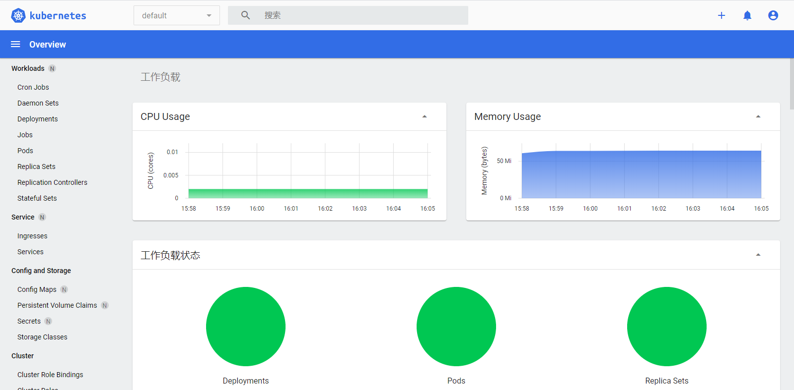

# dashboard安装

参考 [https://kubernetes.io/docs/tasks/access-application-cluster/web-ui-dashboard/](!https://kubernetes.io/docs/tasks/access-application-cluster/web-ui-dashboard/)

- 部署服务

下载配置文件

```bash
wget https://raw.githubusercontent.com/kubernetes/dashboard/v2.0.0/aio/deploy/recommended.yaml
```

修改recommended.yaml，配置https访问
> 默认的配置只能本地访问，其他ip访问需要配置https

修改前

```yaml
kind: Service
apiVersion: v1
metadata:
  labels:
    k8s-app: kubernetes-dashboard
  name: kubernetes-dashboard
  namespace: kubernetes-dashboard
spec:
  ports:
    - port: 443
      targetPort: 8443
  selector:
    k8s-app: kubernetes-dashboard
```

修改后

```yaml
kind: Service
apiVersion: v1
metadata:
  labels:
    k8s-app: kubernetes-dashboard
  name: kubernetes-dashboard
  namespace: kubernetes-dashboard
spec:
  type: NodePort
  ports:
    - port: 443
      targetPort: 8443
      nodePort: 30443
  selector:
    k8s-app: kubernetes-dashboard
```

部署服务`kubectl apply -f recommended.yaml`

- 查看运行状态

```bash
[root@xw101 ~]# kubectl -n kubernetes-dashboard get pods
NAME                                         READY   STATUS    RESTARTS   AGE
dashboard-metrics-scraper-7b59f7d4df-8n9dk   1/1     Running   0          14m
kubernetes-dashboard-665f4c5ff-q52ng         1/1     Running   0          14m
```

- 创建登录用户

创建dashboard-adminuser.yaml

```bash
cat > dashboard-adminuser.yaml << EOF
apiVersion: v1
kind: ServiceAccount
metadata:
  name: admin-user
  namespace: kubernetes-dashboard

---
apiVersion: rbac.authorization.k8s.io/v1
kind: ClusterRoleBinding
metadata:
  name: admin-user
roleRef:
  apiGroup: rbac.authorization.k8s.io
  kind: ClusterRole
  name: cluster-admin
subjects:
- kind: ServiceAccount
  name: admin-user
  namespace: kubernetes-dashboard  
EOF
```

生成登录用户`kubectl apply -f dashboard-adminuser.yaml`

获取token，`kubectl -n kubernetes-dashboard describe secret $(kubectl -n kubernetes-dashboard get secret | grep admin-user | awk '{print $1}')`

访问[https://任意worker节点ip:30443/#/deployment?namespace=default]


