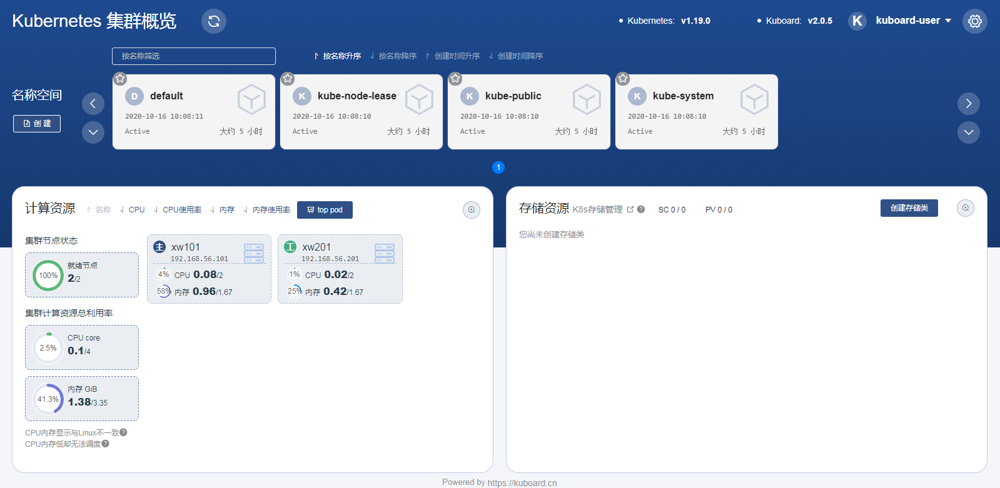

# kuboard安装

参考 [https://kuboard.cn/install/install-dashboard.html](!https://kuboard.cn/install/install-dashboard.html)

- 部署服务

```bash
kubectl apply -f https://kuboard.cn/install-script/kuboard.yaml
kubectl apply -f https://addons.kuboard.cn/metrics-server/0.3.7/metrics-server.yaml
```

- 查看运行状态

```bash
[root@xw101 ~]# kubectl get pods -l k8s.kuboard.cn/name=kuboard -n kube-system
NAME                       READY   STATUS    RESTARTS   AGE
kuboard-655785f55c-7274g   1/1     Running   1          4h1m
```

- 获取token登录

```bash
echo $(kubectl -n kube-system get secret $(kubectl -n kube-system get secret | grep kuboard-user | awk '{print $1}') -o go-template='{{.data.token}}' | base64 -d)
```

- 访问页面[http://任意一个Worker节点的IP地址:32567/]


