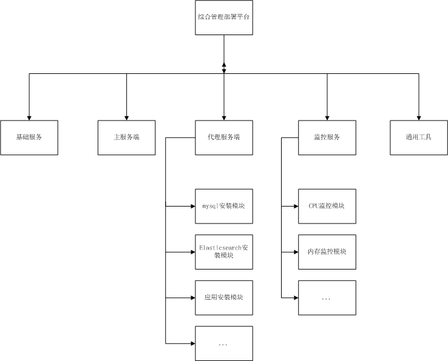
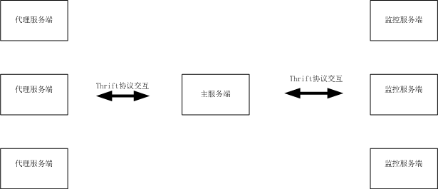

# 综合管理部署平台
  
  用来部署各种应用组件以及其依赖组件，管理各应用组件的版本更新和回滚，监控各应用组件的运行情况和服务器情况
以及远程操作服务端等。

---------

## 模块划分

## 功能描述

- [基础服务](#基础服务)
 - 依赖安装
 - 服务管理
 - ...
- [主服务端](#主服务端)
 - 后台服务
 - 前端页面
 - ...
- [代理服务端](#代理服务端)
 - 组件安装卸载
 - 版本管理
 - ...
- [监控服务](#监控服务)
 - 服务器状态监控
 - 应用状态监控
 - 日志管理
 - ...
- [通用工具](#通用工具)

### 基础服务

- 依赖安装
  - 实现自身服务的安装，理论上服务端不需要提前安装其他依赖组件，可以自动的检查所需环境，安装缺失的组件
- 服务管理
  - 控制基础服务的启动关闭

### 主服务端

- 后台服务
  - 主要的服务组件，与代理服务、监控服务实现交互，记录各种操作情况
- 前端页面
  - 与后台服务交互，提供用户使用的前台操作页面

### 代理服务端

- 组件安装卸载
  - 响应主服务端的安装指令，获取安装信息，进行组件的安装，安装完毕后，请用主服务端，记录安装结果
  - 响应主服务端的卸载指令，获取卸载信息，进行组件的安装，卸载完毕后，请用主服务端，记录卸载结果
- 版本管理
  - 管理组件的安装情况
  - 实现组件的更新和回滚

### 监控服务

- 服务器状态监控
  - 与主服务端交互、监控服务cpu、硬盘、内存等情况
- 应用状态监控
 - 与主服务端交互、监控应用的存活情况
- 日志管理
 - 与主服务端交互、管理各应用产生的日志

### 流程逻辑

#### 服务交互流程

#### 操作流程
- 安装基础服务

- 启动主服务端

- 安装代理服务端

- 安装监控服务端

- 安装所需应用组件

