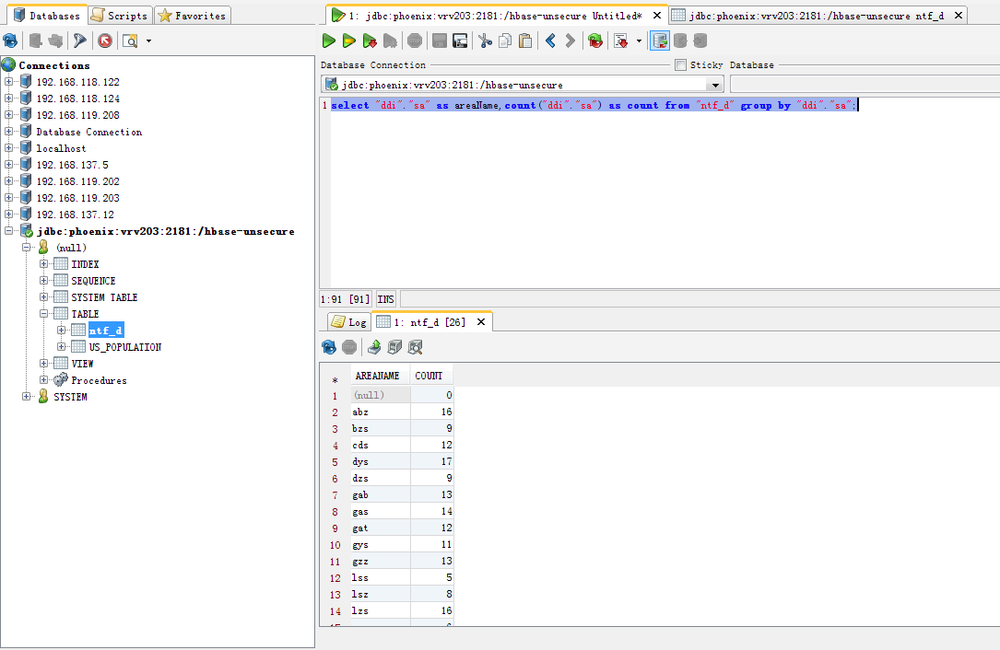

# 简介

We put SQL back in NoSQL(利用sql去查询hbase的开源框架)

---

## 安装

- 下载[apache-phoenix-4.11.0-HBase-1.1-bin](http://apache.01link.hk/phoenix/ "http://apache.01link.hk/phoenix/")

- 解压下载文件,将*phoenix-4.11.0-HBase-1.1-server.jar*复制到集群的hbase目录中的lib目录下

> [root@vrv203 /]# scp /usr/hdp/2.4.0.0-169/hbase/lib/phoenix-4.11.0-HBase-1.1-server.jar root@vrv204://usr/hdp/2.4.0.0-169/hbase/lib/
phoenix-4.11.0-HBase-1.1-server.jar                                            100%   24MB  24.1MB/s   00:00    
> [root@vrv203 /]# scp /usr/hdp/2.4.0.0-169/hbase/lib/phoenix-4.11.0-HBase-1.1-server.jar root@vrv205://usr/hdp/2.4.0.0-169/hbase/lib/
phoenix-4.11.0-HBase-1.1-server.jar                                                  100%   24MB  24.1MB/s   00:01    
> [root@vrv203 /]# scp /usr/hdp/2.4.0.0-169/hbase/lib/phoenix-4.11.0-HBase-1.1-server.jar root@vrv206://usr/hdp/2.4.0.0-169/hbase/lib/
phoenix-4.11.0-HBase-1.1-server.jar                                                  100%   24MB  24.1MB/s   00:00    
> [root@vrv203 /]# scp /usr/hdp/2.4.0.0-169/hbase/lib/phoenix-4.11.0-HBase-1.1-server.jar root@vrv207://usr/hdp/2.4.0.0-169/hbase/lib/
phoenix-4.11.0-HBase-1.1-server.jar                                                  100%   24MB  24.1MB/s   00:01

- 重启hbase

- 将解压出来的文件夹复制到集群的一台机器上去

> /usr/hdp/2.4.0.0-169/apache-phoenix-4.11.0-HBase-1.1-bin

- 修改文件执行权限

>chmod 755 /usr/hdp/2.4.0.0-169/apache-phoenix-4.11.0-HBase-1.1-bin/bin/*.py
---

## 使用

- 创建 *us_population.sql*

```sql
CREATE TABLE IF NOT EXISTS us_population (
    state CHAR(2) NOT NULL,
    city VARCHAR NOT NULL,
    population BIGINT CONSTRAINT my_pk PRIMARY KEY (state,city)
);
```

- 创建 *us_population.csv*

state|city|population
-|-|-
NY|New York|8143197
CA|Los Angeles|3844829
IL|Chicago|2842518
TX|Houston|2016582
PA|Philadelphia|1463281
AZ|Phoenix|1461575
TX|San Antonio|1256509
CA|San Diego|1255540
TX|Dallas|1213825
CA|San Jose|912332

- 创建 *us_population_queries.sql*

```sql
SELECT state as "State",count(city) as "City Count",sum(population) as "Population Sum"
FROM us_population
GROUP BY state
ORDER BY sum(population) DESC;
```

- 切换到phoenix的bin目录下执行以下命令

```shell
./psql.py vrv203:2181:/hbase-unsecure ../examples/us_population.sql ../examples/us_population.csv ../examples/us_population_queries.sql
```

  输出
 
St|City Count|Population Sum 
-|-|-
NY|1|8143197 
CA|1|3844829
...|...|...

## 命令行

- 在bin目录下执行,进去phoenix的控制台`./sqlline.py`
- 输入`!help`显示命令列表
- 其他数据库、表操作类似mysql

## hbase表查询

- 原始hbase中的表

```sql
create 'ntf_d','ddv','ddi','ddp'
```

- 原始hbase中的数据

```shell
base(main):011:0> scan 'ntf_d',{LIMIT=>1}
````

> ROW                            COLUMN+CELL                                                                             
 20170521_10.66.73.10_0000001  column=ddi:count, timestamp=1495422713784, value=42983                                  
 20170521_10.66.73.10_0000001  column=ddi:da, timestamp=1495422713784, value=unknown                                   
 20170521_10.66.73.10_0000001  column=ddi:dip, timestamp=1495422713784, value=10.66.73.10                              
 20170521_10.66.73.10_0000001  column=ddi:dp, timestamp=1495422713784, value=42222                                     
 20170521_10.66.73.10_0000001  column=ddi:sa, timestamp=1495422713784, value=unknown                                   
 20170521_10.66.73.10_0000001  column=ddi:sip, timestamp=1495422713784, value=10.70.147.109                            
 20170521_10.66.73.10_0000001  column=ddp:count, timestamp=1495422716604, value=42983                                  
 20170521_10.66.73.10_0000001  column=ddp:da, timestamp=1495422716604, value=unknown                                   
 20170521_10.66.73.10_0000001  column=ddp:dip, timestamp=1495422716604, value=10.66.73.10                              
 20170521_10.66.73.10_0000001  column=ddp:dp, timestamp=1495422716604, value=42222                                     
 20170521_10.66.73.10_0000001  column=ddp:sa, timestamp=1495422716604, value=unknown                                   
 20170521_10.66.73.10_0000001  column=ddp:sip, timestamp=1495422716604, value=10.70.147.109                            
 20170521_10.66.73.10_0000001  column=ddv:count, timestamp=1495422710928, value=42983                                  
 20170521_10.66.73.10_0000001  column=ddv:da, timestamp=1495422710928, value=unknown                                   
 20170521_10.66.73.10_0000001  column=ddv:dip, timestamp=1495422710928, value=10.66.73.10                              
 20170521_10.66.73.10_0000001  column=ddv:dp, timestamp=1495422710928, value=42222                                     
 20170521_10.66.73.10_0000001  column=ddv:sa, timestamp=1495422710928, value=unknown                                   
 20170521_10.66.73.10_0000001  column=ddv:sip, timestamp=1495422710928, value=10.70.147.109

- 在phoenix中关联hbase中的该表

```sql
CREATE TABLE IF NOT EXISTS "ntf_d" 
(
    "rk" CHAR(4) NOT NULL PRIMARY KEY, 
    "ddi"."count" INTEGER,
    "ddi"."da" VARCHAR(32), 
    "ddi"."dip" VARCHAR(32), 
    "ddi"."dp" VARCHAR(32),
    "ddi"."sa" VARCHAR(32),
    "ddi"."sip" VARCHAR(32),
    "ddi"."sp" VARCHAR(32),
    "ddp"."count" INTEGER,
    "ddp"."da" VARCHAR(32), 
    "ddp"."dip" VARCHAR(32), 
    "ddp"."dp" VARCHAR(32),
    "ddp"."sa" VARCHAR(32),
    "ddp"."sip" VARCHAR(32),
    "ddp"."sp" VARCHAR(32),
    "ddv"."count" INTEGER,
    "ddv"."da" VARCHAR(32), 
    "ddv"."dip" VARCHAR(32), 
    "ddv"."dp" VARCHAR(32),
    "ddv"."sa" VARCHAR(32),
    "ddv"."sip" VARCHAR(32),
    "ddv"."sp" VARCHAR(32)
);
```

- 显示创建结果`!tables`
- 表关联后可对表进行一些类似mysql的查询操作

```sql
select "ddi"."sa" as areaName,count("ddi"."sa") as count
from "ntf_d" group by "ddi"."sa";
```

- 执行结果

| AREANAME  | COUNT  |
-|-
|     .     | 0      |
| abz       | 16     |
| bzs       | 9      |
| cds       | 12     |
| dys       | 17     |
| dzs       | 9      |
| gab       | 13     |
| gas       | 14     |
| gat       | 12     |
| gys       | 11     |
| gzz       | 13     |
| lss       | 5      |
| lsz       | 8      |
| lzs       | 16     |
| mss       | 6      |
| mys       | 9      |
| ncs       | 11     |
| njs       | 5      |
| other     | 10     |
| pzh       | 14     |
| sns       | 7      |
| unknown   | 36904  |
| yas       | 10     |
| ybs       | 12     |
| zgs       | 12     |
| zys       | 11     |

## java客户端使用

- 导入依赖jar包

```xml
<dependency>
    <groupId>org.apache.phoenix</groupId>
    <artifactId>phoenix-core</artifactId>
    <version>4.11.0-HBase-1.1</version>
</dependency>
```

- 编写测试代码

```java
public static void main(String[] args) throws ClassNotFoundException, SQLException {
    String driver = "org.apache.phoenix.jdbc.PhoenixDriver";
    String url = "jdbc:phoenix:vrv203:2181:/hbase-unsecure";

    Class.forName(driver);

    Connection conn = DriverManager.getConnection(url);

    Statement stmt = conn.createStatement();

    ResultSet rs = stmt.executeQuery(
            "select \"ddi\".\"sa\" as areaName,count(\"ddi\".\"sa\") as count from \"ntf_d\" group by \"ddi\".\"sa\"");
    
    while(rs.next()){
        System.out.println(rs.getString(1)+"|"+rs.getLong(2));
    }
    
    rs.close();
    stmt.close();
    conn.close();
}
```

- 执行结果

| AREANAME  | COUNT  |
-|-
null|0
abz|16
bzs|9
cds|12
dys|17
dzs|9
gab|13
gas|14
gat|12
gys|11
gzz|13
lss|5
lsz|8
lzs|16
mss|6
mys|9
ncs|11
njs|5
other|10
pzh|14
sns|7
unknown|36904
yas|10
ybs|12
zgs|12
zys|11

## 数据库连接工具使用


